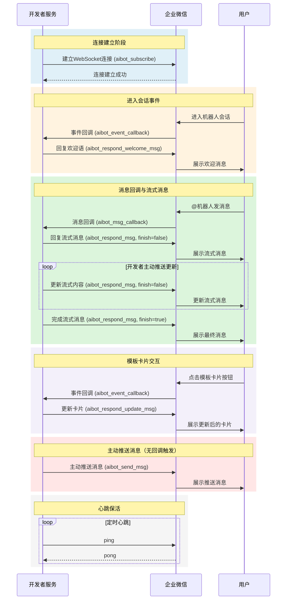
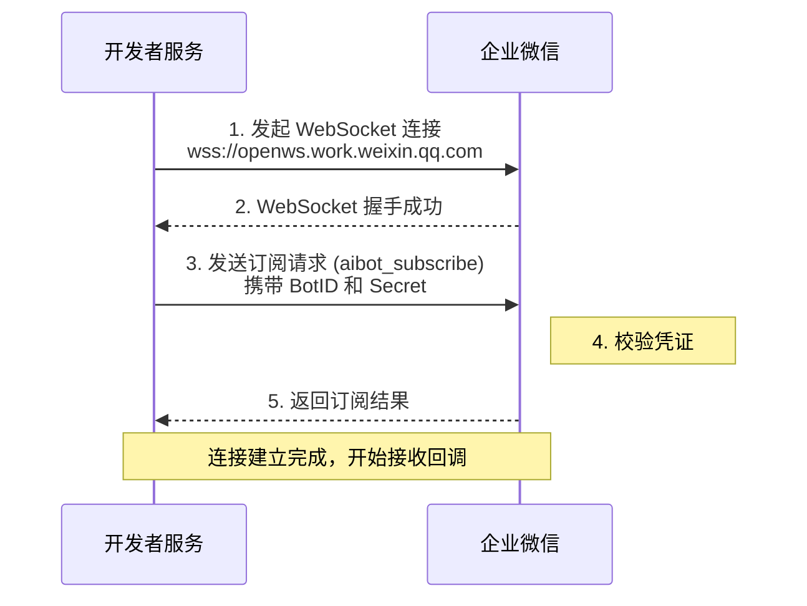
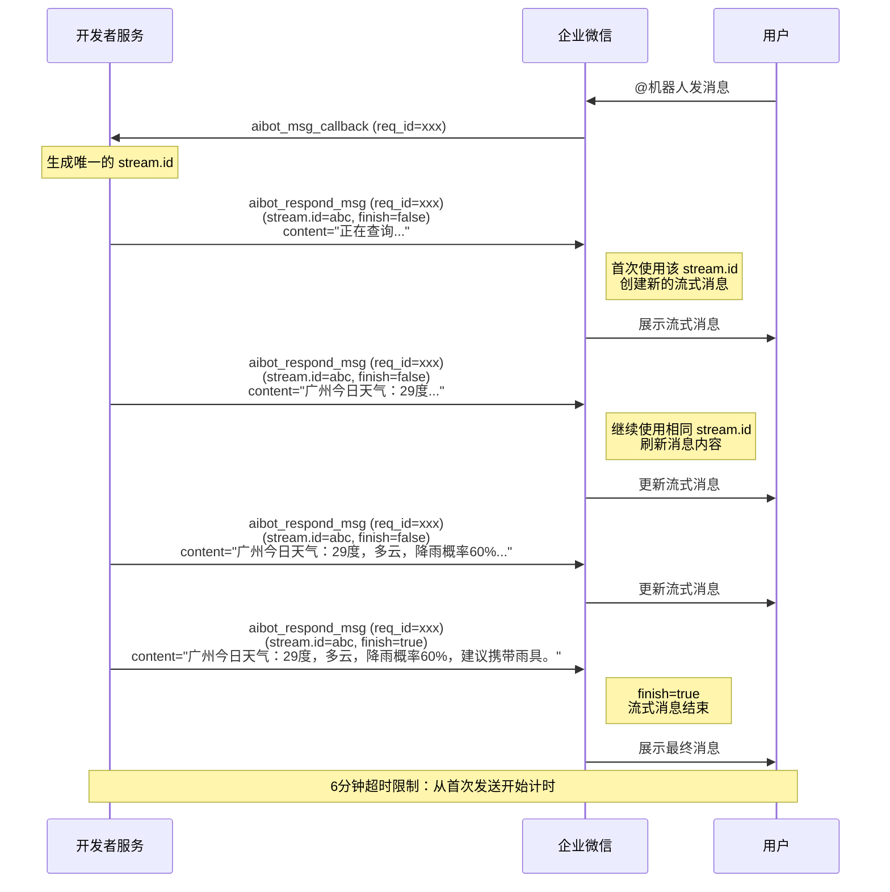

[TOC]

# 概述
## 通过部署SDK建立长连接

| 语言 | 下载地址 |
| --- | --- |
| Node.js | [aibot-node-sdk](https://www.npmjs.com/package/@wecom/aibot-node-sdk) |

## 长连接与短连接（Webhook）方式对比

智能机器人支持两种 API 模式接收消息回调：

| 特性 | Webhook（短连接） | WebSocket（长连接） |
| --- | --- | --- |
| 连接方式 | 每次回调建立新连接 | 复用已建立的长连接 |
| 延迟 | 较高（每次需建连） | 低（复用连接） |
| 实时性 | 一般 | 好 |
| 服务端要求 | 需要公网可访问的 URL | 无需固定的公网 IP |
| 加解密 | 需要对消息加解密 | 无需加解密 |
| 复杂度 | 低 | 较高（需维护心跳） |
| 可靠性 | 高（无状态） | 需要心跳保活、断线重连 |
| 适用场景 | 普通回调场景 | 高实时性要求、无固定公网 IP 场景 |

## 适用场景

推荐使用 WebSocket 长连接方式的场景：
- **无公网 IP**：开发者服务部署在内网环境，无法配置公网可访问的回调 URL
- **高实时性要求**：需要更低的消息延迟
- **简化开发**：无需处理消息加解密逻辑

## 整体交互流程

长连接模式的交互流程如下：



**流程说明：**

1. **连接建立阶段**：开发者服务使用 BotID 和 Secret 向企业微信发起 WebSocket 连接请求（aibot_subscribe），连接建立成功后保持长连接状态

2. **进入会话事件**：用户首次进入机器人单聊会话时，企业微信推送事件回调（aibot_event_callback），开发者可回复欢迎语（aibot_respond_welcome_msg）

3. **消息回调与流式消息**：用户在群聊中@机器人或向机器人发送单聊消息时，企业微信推送消息回调（aibot_msg_callback）。与「设置接收消息 URL」模式不同，**长连接模式下不再有流式刷新回调**，开发者需主动推送流式更新内容，直到设置 `finish=true` 结束流式消息

4. **模板卡片交互**：用户点击模板卡片按钮时，企业微信推送事件回调（aibot_event_callback），开发者可更新卡片内容（aibot_respond_update_msg）

5. **主动推送消息**：开发者可在没有用户消息触发的情况下，通过 `aibot_send_msg` 主动向用户或群聊推送消息，适用于定时提醒、异步任务通知、告警推送等场景

6. **心跳保活**：开发者需定期发送心跳（ping）保持连接活跃，建议间隔 30 秒

---

# 长连接配置说明

## 开启长连接 API 模式

在企业微信管理后台，进入智能机器人的配置页面，开启「API 模式」并选择「长连接」方式：


## 获取凭证

开启长连接 API 模式后，需要获取以下凭证用于建立连接：

| 凭证 | 说明 |
| --- | --- |
| BotID | 智能机器人的唯一标识，用于标识机器人身份 |
| Secret | 长连接专用密钥，用于身份校验 |

> **注意**：
> - Secret 是长连接专用的密钥，与设置接收消息回调地址模式的 Token/EncodingAESKey 不同
> - 请妥善保管 Secret，避免泄露
> - **模式切换影响**：API 模式只能选择一种方式（长连接或设置接收消息回调地址），切换到「设置接收消息回调地址」模式会导致现有长连接失效；反之，从「设置接收消息回调地址」切换到「长连接」模式后，原有的回调地址将不再生效

---

# 建立长连接

## WebSocket 连接地址

```
wss://openws.work.weixin.qq.com
```

## 连接数量限制

每个智能机器人**同一时间只能保持一个有效的长连接**。当同一个机器人发起新的连接请求并完成订阅（aibot_subscribe）时，**新连接会踢掉旧连接**，旧连接将被服务端主动断开。

> **注意**：
> - 开发者需要在业务层面避免同一机器人建立多个长连接
> - 如果需要实现高可用，建议采用主备切换模式而非同时多连接
> - 旧连接被踢掉时，开发者会收到连接断开事件

## 连接建立流程

建立长连接的完整流程：



## 订阅请求

WebSocket 连接建立后，需要发送订阅请求（aibot_subscribe）进行身份校验。
> 注意：该请求有频率保护，订阅成功后应避免反复请求，否则可能触发系统限制。

**请求示例：**

```json
{
    "cmd": "aibot_subscribe",
    "headers": {
        "req_id": "REQUEST_ID"
    },
    "body": {
        "bot_id": "BOTID",
        "secret": "SECRET"
    }
}
```

**请求字段说明：**

| 字段 | 类型 | 必填 | 说明 |
| --- | --- | --- | --- |
| cmd | string | 是 | 命令类型，固定值 `aibot_subscribe` |
| headers.req_id | string | 是 | 请求唯一标识，由开发者自行生成，用于关联请求和响应 |
| body.bot_id | string | 是 | 智能机器人的 BotID，获取方法参考[配置说明](#长连接配置说明) |
| body.secret | string | 是 | 长连接专用密钥 Secret，获取方法参考[配置说明](#长连接配置说明) |

**响应示例：**

```json
{
    "headers": {
        "req_id": "REQUEST_ID"
    },
    "errcode": 0,
    "errmsg": "ok"
}
```

**响应字段说明：**

| 字段 | 类型 | 说明 |
| --- | --- | --- |
| headers.req_id | string | 透传请求中的 req_id |
| errcode | int | 错误码，0 表示成功 |
| errmsg | string | 错误信息，成功时为 "ok" |

---

# 接收消息回调

用户向智能机器人发送消息时，企业微信会通过长连接推送消息回调（aibot_msg_callback）。

## 消息推送格式

**请求示例（文本消息）：**

```json
{
    "cmd": "aibot_msg_callback",
    "headers": {
        "req_id": "REQUEST_ID"
    },
    "body": {
        "msgid": "MSGID",
        "aibotid": "AIBOTID",
        "chatid": "CHATID",
        "chattype": "group",
        "from": {
            "userid": "USERID"
        },
        "msgtype": "text",
        "text": {
            "content": "@RobotA hello robot"
        }
    }
}
```

**请求字段说明：**

| 字段 | 类型 | 说明 |
| --- | --- | --- |
| cmd | string | 命令类型，固定值 `aibot_msg_callback` |
| headers.req_id | string | 请求唯一标识，回复消息时需透传 |
| body.msgid | string | 本次回调的唯一性标志，用于事件排重 |
| body.aibotid | string | 智能机器人 BotID |
| body.chatid | string | 会话 ID，仅群聊类型时返回 |
| body.chattype | string | 会话类型，`single` 单聊 / `group` 群聊 |
| body.from.userid | string | 消息发送者的 userid |
| body.msgtype | string | 消息类型 |

## 支持的消息类型

长连接模式支持以下消息类型的回调：

| 消息类型 | msgtype | 说明 |
| --- | --- | --- |
| [文本消息](#57141/文本消息) | text | 用户发送的文本内容 |
| [图片消息](#57141/图片消息) | image | 用户发送的图片，仅支持单聊 |
| [图文混排](#57141/图文混排消息) | mixed | 用户发送的图文混排内容 |
| [语音消息](#57141/语音消息) | voice | 用户发送的语音（转为文本），仅支持单聊 |
| [文件消息](#57141/文件消息) | file | 用户发送的文件，仅支持单聊 |

> **说明**：各消息类型的 body 结构与设置接收消息回调地址模式一致，详细字段请参考对应链接。

## 多媒体资源解密

长连接模式下，`image` 和 `file` 结构体中会额外返回解密密钥 `aeskey`，用于解密下载的资源文件：

**图片结构体示例：**

```json
{
    "image": {
        "url": "URL",
        "aeskey": "AESKEY"
    }
}
```

**文件结构体示例：**

```json
{
    "file": {
        "url": "URL",
        "aeskey": "AESKEY"
    }
}
```

| 字段 | 类型 | 说明 |
| --- | --- | --- |
| url | string | 资源下载地址，5 分钟内有效 |
| aeskey | string | 解密密钥，每个下载链接的 aeskey 唯一 |

> **注意**：
> - 每个 URL 对应的 aeskey 都是唯一的，不同于设置接收消息回调地址模式使用统一的 EncodingAESKey
> - 加密方式：AES-256-CBC，数据采用 **PKCS#7** 填充至 32 字节的倍数
> - IV 初始向量大小为 16 字节，取 aeskey 前 16 字节

---

# 接收事件回调

用户与智能机器人发生交互时，企业微信会通过长连接推送事件回调（aibot_event_callback）。

## 事件推送格式

**请求示例（进入会话事件）：**

```json
{
    "cmd": "aibot_event_callback",
    "headers": {
        "req_id": "REQUEST_ID"
    },
    "body": {
        "msgid": "MSGID",
        "create_time": 1700000000,
        "aibotid": "AIBOTID",
        "from": {
            "userid": "USERID"
        },
        "msgtype": "event",
        "event": {
            "eventtype": "enter_chat"
        }
    }
}
```

**请求字段说明：**

| 字段 | 类型 | 说明 |
| --- | --- | --- |
| cmd | string | 命令类型，固定值 `aibot_event_callback` |
| headers.req_id | string | 请求唯一标识，回复消息时需透传 |
| body.msgid | string | 本次回调的唯一性标志，用于事件排重 |
| body.create_time | int | 事件产生的时间戳 |
| body.aibotid | string | 智能机器人 BotID |
| body.chatid | string | 会话 ID，仅群聊类型时返回 |
| body.chattype | string | 会话类型，`single` 单聊 / `group` 群聊 |
| body.from.userid | string | 事件触发者的 userid |
| body.msgtype | string | 消息类型，事件回调固定为 `event` |
| body.event.eventtype | string | 事件类型 |

## 支持的事件类型

长连接模式支持以下事件类型的回调：

| 事件类型 | eventtype | 说明 |
| --- | --- | --- |
| [进入会话事件](#59058/进入会话事件) | enter_chat | 用户当天首次进入机器人单聊会话 |
| [模板卡片事件](#59058/模板卡片事件) | template_card_event | 用户点击模板卡片按钮 |
| [用户反馈事件](#59058/用户反馈事件) | feedback_event | 用户对机器人回复进行反馈 |
|[连接断开事件](#连接断开事件格式示例)|disconnected_event|当有新连接建立时，系统会给旧连接发送该事件并且主动断开旧连接|

### 连接断开事件格式示例
```json
{
    "cmd": "aibot_event_callback",
    "headers": {
        "req_id": "REQUEST_ID"
    },
    "body": {
        "msgid": "MSGID",
        "create_time": 1700000000,
        "aibotid": "AIBOTID",
        "msgtype": "event",
        "event": {
            "eventtype": "disconnected_event"
        }
    }
}
```
**连接断开事件字段说明：**

| 字段 | 类型 | 说明 |
| --- | --- | --- |
| cmd | string | 命令类型，固定值 `aibot_event_callback` |
| headers.req_id | string | 请求唯一标识，回复消息时需透传 |
| body.msgid | string | 本次回调的唯一性标志，用于事件排重 |
| body.create_time | int | 事件产生的时间戳 |
| body.aibotid | string | 智能机器人 BotID |
| body.msgtype | string | 消息类型，事件回调固定为 `event` |
| body.event.eventtype | string | 此时固定为`disconnected_event`|

> **说明**：除连接断开事件外，其他各事件类型的 body 结构与设置接收消息回调地址模式一致，详细字段请参考对应链接。

---

# 回复消息

收到消息回调或事件回调后，开发者可通过长连接主动回复消息。

## 回复欢迎语

收到进入会话事件（enter_chat）后，开发者可使用 `aibot_respond_welcome_msg` 命令回复欢迎语。

**请求示例（文本欢迎语）：**

```json
{
    "cmd": "aibot_respond_welcome_msg",
    "headers": {
        "req_id": "REQUEST_ID"
    },
    "body": {
        "msgtype": "text",
        "text": {
            "content": "您好！我是智能助手，有什么可以帮您的吗？"
        }
    }
}
```

**请求字段说明：**

| 字段 | 类型 | 必填 | 说明 |
| --- | --- | --- | --- |
| cmd | string | 是 | 命令类型，固定值 `aibot_respond_welcome_msg` |
| headers.req_id | string | 是 | 透传事件回调中的 req_id |
| body | object | 是 | 消息内容，详见[回复欢迎语](#59068/回复欢迎语) |

**响应示例：**

```json
{
    "headers": {
        "req_id": "REQUEST_ID"
    },
    "errcode": 0,
    "errmsg": "ok"
}
```

> **注意**：
> - 该命令仅适用于进入会话事件，其他事件类型不支持
> - 收到事件回调后需在 **5 秒内** 发送回复，超时将无法发送欢迎语

## 回复普通消息

收到消息回调（aibot_msg_callback）后，开发者可使用 `aibot_respond_msg` 命令回复消息。支持流式消息、模板卡片及组合回复。

**频率限制**：收到消息回调后，24 小时内可以往该会话回复 30 条消息。每次收到消息回调，会恢复该会话的回复消息额度（即24小时内30条消息）。当回复消息的额度消耗完，会消耗主动推送消息额度（参见：[主动推送消息](#主动推送消息))。

> **版本要求**：回复流式消息需要企业微信客户端 **5.0.6** 及以上版本支持。

### 流式消息回复机制

流式消息的发送和刷新通过 `stream.id` 进行关联：

- **发送流式消息**：首次使用某个 `stream.id` 回复时，会创建一条新的流式消息
- **刷新流式消息**：继续使用相同的 `stream.id` 推送时，会更新该流式消息的内容
- **完成流式消息**：设置 `finish=true` 结束流式消息，消息将不再可更新

> **注意**：从流式消息发送开始，需在 **6 分钟内** 完成所有刷新并设置 `finish=true`，否则消息将自动结束。

**两种模式的流式刷新方式对比：**

| 模式 | 刷新方式 | 说明 |
| --- | --- | --- |
| 设置接收消息地址 | 回调轮询 | 企业微信通过轮询回调开发者的接收消息地址来获取流式消息的刷新内容 |
| 长连接 | 主动推送 | 开发者服务主动通过长连接推送流式刷新消息，无需等待回调 |

**流式消息交互流程：**



> **说明**：在长连接模式下，针对同一次消息回调的所有流式消息回复（包括首次发送和后续刷新），都需要使用回调中相同的 `req_id`。`req_id` 用于关联回调请求与响应，`stream.id` 用于标识同一条流式消息。

**请求示例（流式消息回复）：**

```json
{
    "cmd": "aibot_respond_msg",
    "headers": {
        "req_id": "REQUEST_ID"
    },
    "body": {
        "msgtype": "stream",
        "stream": {
            "id": "STREAMID",
            "finish": false,
            "content": "正在为您查询天气信息..."
        }
    }
}
```

**请求字段说明：**

| 字段 | 类型 | 必填 | 说明 |
| --- | --- | --- | --- |
| cmd | string | 是 | 命令类型，固定值 `aibot_respond_msg` |
| headers.req_id | string | 是 | 透传消息回调中的 req_id |
| body | object | 是 | 消息内容，详见[回复用户消息](#59068/回复用户消息) |

> **注意**：目前暂不支持 msg_item 字段。

**响应示例：**

```json
{
    "headers": {
        "req_id": "REQUEST_ID"
    },
    "errcode": 0,
    "errmsg": "ok"
}
```

## 更新模板卡片

收到模板卡片点击事件（template_card_event）后，开发者可使用 `aibot_respond_update_msg` 命令更新卡片内容。

**请求示例：**

```json
{
    "cmd": "aibot_respond_update_msg",
    "headers": {
        "req_id": "REQUEST_ID"
    },
    "body": {
        "response_type": "update_template_card",
        "template_card": {
            "card_type": "button_interaction",
            "main_title": {
                "title": "xx系统告警",
                "desc": "服务器CPU使用率超过90%"
            },
            "button_list": [
                {
                    "text": "确认中",
                    "style": 1,
                    "key": "confirm"
                },
                {
                    "text": "误报",
                    "style": 2,
                    "key": "false_alarm"
                }
            ],
            "task_id": "TASK_ID",
            "feedback": {
                "id": "FEEDBACKID"
            }
        }
    }
}
```

**请求字段说明：**

| 字段 | 类型 | 必填 | 说明 |
| --- | --- | --- | --- |
| cmd | string | 是 | 命令类型，固定值 `aibot_respond_update_msg` |
| headers.req_id | string | 是 | 透传事件回调中的 req_id |
| body | object | 是 | 消息内容，详见[更新模板卡片](#59068/更新模板卡片) |

**响应示例：**

```json
{
    "headers": {
        "req_id": "REQUEST_ID"
    },
    "errcode": 0,
    "errmsg": "ok"
}
```

> **注意**：
> - 该命令仅适用于模板卡片点击事件，其他事件类型不支持
> - 收到事件回调后需在 **5 秒内** 发送回复，超时将无法更新卡片

---

# 主动推送消息

在某些场景下，开发者需要在没有用户消息触发的情况下，主动向用户或群聊推送消息。例如：
- **定时提醒**：定时推送日报、周报、待办提醒等
- **异步任务通知**：后台任务完成后主动通知用户结果
- **告警推送**：系统监控告警主动推送给相关人员

长连接模式支持通过 `aibot_send_msg` 命令主动推送消息，无需依赖消息回调。特殊的，**需要用户在会话中给机器人发消息，后续机器人才能主动推送消息给对应会话中**。

**频率限制**：每个自然日每个会话可以主动推送 10 条消息。若用户给机器人发送了消息，则相应的会话在24小时内有回复30条消息的额度，机器人主动推送消息时，会优先消耗此30条回复消息的额度。

## 请求格式

**请求示例（markdown 消息）：**

```json
{
    "cmd": "aibot_send_msg",
    "headers": {
        "req_id": "REQUEST_ID"
    },
    "body": {
        "chatid": "CHATID",
        "msgtype": "markdown",
        "markdown": {
            "content": "这是一条**主动推送**的消息"
        }
    }
}
```

> **说明**：消息 body 的具体格式请参考[消息类型及数据格式](#59947/消息类型及数据格式)。

**请求字段说明：**

| 字段 | 类型 | 必填 | 说明 |
| --- | --- | --- | --- |
| cmd | string | 是 | 命令类型，固定值 `aibot_send_msg` |
| headers.req_id | string | 是 | 请求唯一标识，由开发者自行生成，用于关联请求和响应 |
| body.chatid | string | 是 | 会话 ID，支持单聊和群聊。单聊填用户的 userid，群聊填对应群聊相关回调事件中获取的chatid |
| body.msgtype | string | 是 | 消息类型，支持 `template_card`（模板卡片）、`markdown` |
| body.template_card | object | 否 | 模板卡片内容，msgtype 为 template_card 时必填 |
| body.markdown | object | 否 | markdown 消息内容，msgtype 为 markdown 时必填 |

## 响应格式

**响应示例：**

```json
{
    "headers": {
        "req_id": "REQUEST_ID"
    },
    "errcode": 0,
    "errmsg": "ok"
}
```

**响应字段说明：**

| 字段 | 类型 | 说明 |
| --- | --- | --- |
| headers.req_id | string | 透传请求中的 req_id |
| errcode | int | 错误码，0 表示成功 |
| errmsg | string | 错误信息，成功时为 "ok" |

## 支持的消息类型

| 消息类型 | msgtype | 说明 |
| --- | --- | --- |
| 模板卡片 | template_card | 模板卡片消息，详见[消息类型及数据格式](#59947/消息类型及数据格式) |
| Markdown | markdown | Markdown 格式消息，详见[消息类型及数据格式](#59947/消息类型及数据格式) |

---

# 保持心跳

连接建立成功后，开发者需定期发送心跳请求（ping）保持连接活跃，防止连接被服务端主动断开。

## 心跳机制说明

- **心跳间隔**：建议每 **30 秒** 发送一次心跳
- **超时断开**：若长时间未收到心跳，服务端会主动断开连接
- **断线重连**：开发者需实现断线检测和自动重连机制

## 心跳请求

**请求示例：**

```json
{
    "cmd": "ping",
    "headers": {
        "req_id": "REQUEST_ID"
    }
}
```

**请求字段说明：**

| 字段 | 类型 | 必填 | 说明 |
| --- | --- | --- | --- |
| cmd | string | 是 | 命令类型，固定值 `ping` |
| headers.req_id | string | 是 | 请求唯一标识，由开发者自行生成 |

**响应示例：**

```json
{
    "headers": {
        "req_id": "REQUEST_ID"
    },
    "errcode": 0,
    "errmsg": "ok"
}
```

**响应字段说明：**

| 字段 | 类型 | 说明 |
| --- | --- | --- |
| headers.req_id | string | 透传请求中的 req_id |
| errcode | int | 错误码，0 表示成功 |
| errmsg | string | 错误信息，成功时为 "ok" |

---

