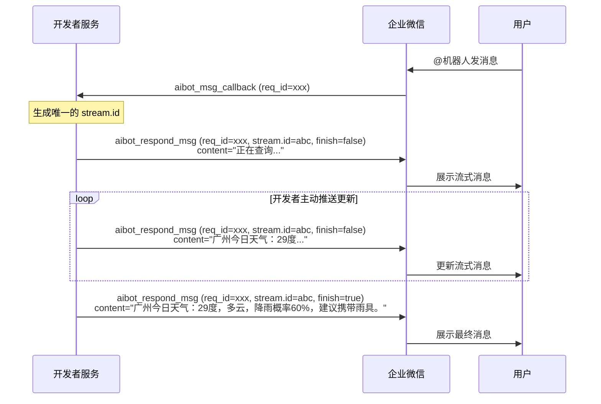

[TOC]

## 概述

收到消息回调或事件回调后，开发者可通过长连接回复消息。根据触发场景的不同，使用不同的命令：

| 场景 | 命令 | 说明 |
|---|---|---|
| 收到进入会话事件 | `aibot_respond_welcome_msg` | 回复欢迎语 |
| 收到消息回调 | `aibot_respond_msg` | 回复流式消息或模板卡片 |
| 收到模板卡片事件 | `aibot_respond_update_msg` | 更新模板卡片 |

> **频率限制**：无论回复还是[主动推送](#62158)，给某个会话发消息的限制为 30 条/分钟，1000 条/小时。

---

## 回复欢迎语（aibot_respond_welcome_msg）

收到[进入会话事件](#62156/支持的事件类型)后，使用此命令回复欢迎语。

>收到事件回调后需在 **5 秒内**发送回复，超时将无法发送。

**请求示例（文本欢迎语）：**

```json
{
    "cmd": "aibot_respond_welcome_msg",
    "headers": {
        "req_id": "REQUEST_ID"
    },
    "body": {
        "msgtype": "text",
        "text": {
            "content": "您好！我是智能助手，有什么可以帮您的吗？"
        }
    }
}
```

| 字段 | 类型 | 必填 | 说明 |
|---|---|---|---|
| cmd | string | 是 | 固定值 `aibot_respond_welcome_msg` |
| headers.req_id | string | 是 | 透传事件回调中的 req_id |
| body | object | 是 | 消息内容，支持文本消息和模板卡片消息，格式参考[接收 URL 方式 — 回复欢迎语](#62165/回复欢迎语) |

---

## 回复普通消息（aibot_respond_msg）

收到[消息回调](#62155)后，使用此命令回复消息。

> 收到消息回调后，24小时内可向该会话回复消息。

**请求示例（通用格式）：**

```json
{
    "cmd": "aibot_respond_msg",
    "headers": {
        "req_id": "REQUEST_ID"
    },
    "body": {
        "msgtype": "msgtype_name",
        "msgtype_name": {}
    }
}
```

**请求字段说明：**

| 字段 | 类型 | 必填 | 说明 |
|---|---|---|---|
| cmd | string | 是 | 固定值 `aibot_respond_msg` |
| headers.req_id | string | 是 | 透传消息回调中的 req_id，同一次回调的所有流式刷新均使用同一个 req_id |
| body.msgtype | string | 是 | 消息类型，同时也是消息内容的字段名，取值见下方各消息类型 |
| body.msgtype_name | object | 是 | 消息内容结构体，字段名与 msgtype 值一致 |

---

### 流式消息

流式消息是长连接模式下最核心的消息类型，适用于 AI 大模型逐步输出内容的场景。

**流式消息回复机制：**

- **首次推送**：使用某个 `stream.id` 首次推送时，创建一条新的流式消息
- **刷新内容**：继续使用相同 `stream.id` 和 `req_id` 推送时，更新该流式消息内容（`content` 字段为全量内容，非增量）
- **结束流式**：设置 `finish=true`，消息将不再可更新

> 从首次推送开始，需在 **10 分钟内**完成所有刷新并设置 `finish=true`，否则消息将自动结束。

与接收 URL 方式的区别：长连接模式下**无流式刷新回调**，开发者主动推送更新内容，无需等待企业微信轮询。

**交互流程：**



**请求示例：**

```json
{
    "cmd": "aibot_respond_msg",
    "headers": {
        "req_id": "REQUEST_ID"
    },
    "body": {
        "msgtype": "stream",
        "stream": {
            "id": "STREAMID",
            "finish": false,
            "content": "正在为您查询天气信息...",
            "feedback": {
                "id": "FEEDBACKID"
            }
        }
    }
}
```

| 参数 | 类型 | 是否必填 | 说明 |
|---|---|---|---|
| body.msgtype | String | 是 | 固定为 `stream` |
| body.stream.id | String | 首次回复必填 | 自定义的唯一 id，首次回复时设置，后续刷新使用相同的 id |
| body.stream.finish | Bool | 否 | 流式消息是否结束，设置为 `true` 后消息不可再更新 |
| body.stream.content | String | 否 | 流式消息内容（全量），最长不超过 20480 字节，UTF-8 编码，支持 [Markdown 格式](#)。若包含 `<think></think>` 标签，客户端会展示思考过程 |
| body.stream.feedback.id | String | 否 | 不为空时，用户反馈会触发[反馈事件](#62156/用户反馈事件)，有效长度 256 字节以内，UTF-8 编码 |

>暂不支持 `msg_item` 字段。

---

### 模板卡片消息

```json
{
    "cmd": "aibot_respond_msg",
    "headers": {
        "req_id": "REQUEST_ID"
    },
    "body": {
        "msgtype": "template_card",
        "template_card": {
            "feedback": {
                "id": "FEEDBACKID"
            }
        }
    }
}
```

| 参数 | 类型 | 是否必填 | 说明 |
|---|---|---|---|
| body.msgtype | String | 是 | 固定为 `template_card` |
| body.template_card | Object | 是 | 模板卡片结构体，参考[模板卡片类型](#62160) |
| body.template_card.feedback.id | String | 否 | 不为空时，用户反馈会触发[反馈事件](#62156/用户反馈事件)，有效长度 256 字节以内，UTF-8 编码 |

---

### Markdown 消息

```json
{
    "cmd": "aibot_respond_msg",
    "headers": {
        "req_id": "REQUEST_ID"
    },
    "body": {
        "msgtype": "markdown",
        "markdown": {
            "content": "**广州**今日天气：29度，多云",
            "feedback": {
                "id": "FEEDBACKID"
            }
        }
    }
}
```

| 参数 | 类型 | 是否必填 | 说明 |
|---|---|---|---|
| body.msgtype | String | 是 | 固定为 `markdown` |
| body.markdown.content | String | 是 | 消息内容，最长不超过 20480 字节，UTF-8 编码，支持 [Markdown 格式](#) |
| body.markdown.feedback.id | String | 否 | 不为空时，用户反馈会触发[反馈事件](#62156/用户反馈事件)，有效长度 256 字节以内，UTF-8 编码 |

---

### 文件消息

```json
{
    "cmd": "aibot_respond_msg",
    "headers": {
        "req_id": "REQUEST_ID"
    },
    "body": {
        "msgtype": "file",
        "file": {
            "media_id": "MEDIA_ID"
        }
    }
}
```

| 参数 | 是否必填 | 说明 |
|---|---|---|
| body.msgtype | 是 | 固定为 `file` |
| body.file.media_id | 是 | 文件 id，通过[上传临时素材](#62159)获取 |

---

### 图片消息

```json
{
    "cmd": "aibot_respond_msg",
    "headers": {
        "req_id": "REQUEST_ID"
    },
    "body": {
        "msgtype": "image",
        "image": {
            "media_id": "MEDIA_ID"
        }
    }
}
```

| 参数 | 是否必填 | 说明 |
|---|---|---|
| body.msgtype | 是 | 固定为 `image` |
| body.image.media_id | 是 | 图片媒体文件 id，通过[上传临时素材](#62159)获取 |

---

### 语音消息

```json
{
    "cmd": "aibot_respond_msg",
    "headers": {
        "req_id": "REQUEST_ID"
    },
    "body": {
        "msgtype": "voice",
        "voice": {
            "media_id": "MEDIA_ID"
        }
    }
}
```

| 参数 | 是否必填 | 说明 |
|---|---|---|
| body.msgtype | 是 | 固定为 `voice` |
| body.voice.media_id | 是 | 语音文件 id，通过[上传临时素材](#62159)获取 |

---

### 视频消息

```json
{
    "cmd": "aibot_respond_msg",
    "headers": {
        "req_id": "REQUEST_ID"
    },
    "body": {
        "msgtype": "video",
        "video": {
            "media_id": "MEDIA_ID",
            "title": "Title",
            "description": "Description"
        }
    }
}
```

| 参数 | 是否必填 | 说明 |
|---|---|---|
| body.msgtype | 是 | 固定为 `video` |
| body.video.media_id | 是 | 视频媒体文件 id，通过[上传临时素材](#62159)获取 |
| body.video.title | 否 | 视频消息标题，不超过 64 字节 |
| body.video.description | 否 | 视频消息描述，不超过 512 字节 |

---

## 更新模板卡片（aibot_respond_update_msg）

收到[模板卡片事件](#62156/支持的事件类型)后，使用此命令更新卡片内容。

> 收到事件回调后需在 **5 秒内**发送回复，超时将无法更新。

**请求示例：**

```json
{
    "cmd": "aibot_respond_update_msg",
    "headers": {
        "req_id": "REQUEST_ID"
    },
    "body": {
        "response_type": "update_template_card",
        "template_card": {
            "card_type": "button_interaction",
            "main_title": {
                "title": "xx系统告警",
                "desc": "服务器CPU使用率超过90%"
            },
            "button_list": [
                {
                    "text": "确认中",
                    "style": 1,
                    "key": "confirm"
                }
            ],
            "task_id": "TASK_ID"
        }
    }
}
```

| 字段 | 类型 | 必填 | 说明 |
|---|---|---|---|
| cmd | string | 是 | 固定值 `aibot_respond_update_msg` |
| headers.req_id | string | 是 | 透传事件回调中的 req_id |
| body | object | 是 | 消息内容，格式参考[模板卡片类型](#62160) |

---

## 通用响应格式

以上三个命令的响应格式一致：

```json
{
    "headers": {
        "req_id": "REQUEST_ID"
    },
    "errcode": 0,
    "errmsg": "ok"
}
```

| 字段 | 类型 | 说明 |
|---|---|---|
| headers.req_id | string | 透传请求中的 req_id |
| errcode | int | 错误码，0 表示成功 |
| errmsg | string | 错误信息，成功时为 "ok" |
