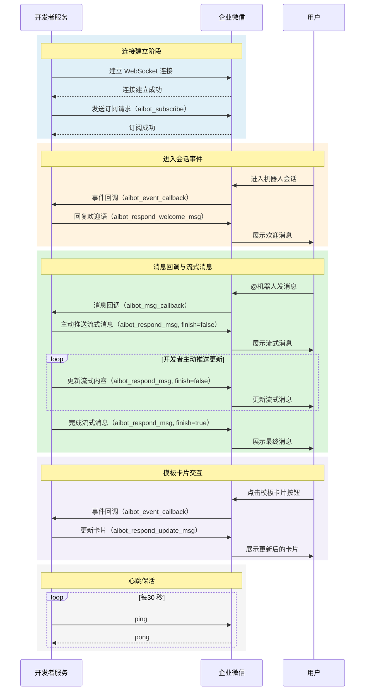
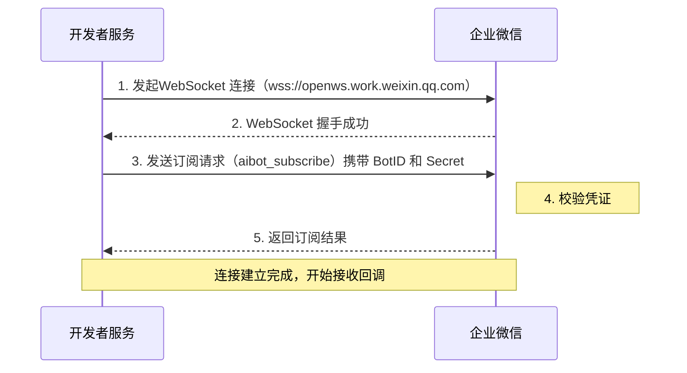

[TOC]

## 概述

长连接方式（WebSocket）是智能机器人 API 模式的另一种连接方式。开发者服务主动向企业微信发起WebSocket 连接，连接建立后企业微信通过该长连接推送消息和事件，开发者也通过同一连接回复消息或主动推送消息。

与接收 URL 方式相比，长连接方式的主要优势：

- **无需公网 IP**：开发者服务部署在内网环境也可接入，无需配置公网可访问的回调地址
- **无需加解密**：消息明文传输，无需处理签名校验和AES 加解密
- **低延迟**：复用持久连接，消息推送实时性更好
- **主动推送流式消息**：无需等待企业微信轮询，由开发者主动控制流式消息推送节奏

两种方式详细对比参考[开发前必读 — 连接方式对比](#62131/连接方式对比)。

### SDK 快速接入

企业微信提供了以下官方 SDK，内置连接管理、心跳保活、断线重连等能力，推荐优先使用：

| 语言 | 下载地址 |
|---|---|
| Node.js | [aibot-node-sdk](https://www.npmjs.com/package/@wecom/aibot-node-sdk) |
| Python | [aibot-python-sdk](https://pypi.org/project/wecom-aibot-python-sdk/) |

---

## 整体交互流程



**流程说明：**

1. **连接建立**：开发者服务发起 WebSocket 连接，握手成功后发送 `aibot_subscribe` 订阅请求完成身份校验
2. **进入会话事件**：用户首次进入单聊会话时，企业微信推送 `aibot_event_callback`，开发者可回复欢迎语
3. **消息回调与流式消息**：用户发消息时企业微信推送 `aibot_msg_callback`，开发者**主动推送**流式更新内容，直到 `finish=true` 结束
4. **模板卡片交互**：用户点击卡片按钮时企业微信推送 `aibot_event_callback`，开发者可更新卡片
5. **心跳保活**：开发者需每 30 秒发送一次 `ping` 保持连接活跃

---

## 开启长连接 API 模式

在管理后台进入智能机器人配置页，开启「API 模式」并选择「长连接」方式：


开启后需获取以下凭证用于建立连接：

| 凭证 | 说明 |
|---|---|
| BotID | 智能机器人的唯一标识 |
| Secret | 长连接专用密钥，用于身份校验 |

> **注意**：Secret 是长连接专用密钥，与接收 URL 方式的 Token/EncodingAESKey 不同，请妥善保管，避免泄露。

---

## 建立连接

### WebSocket 连接地址

```
wss://openws.work.weixin.qq.com
```

### 连接数量限制

每个智能机器人**同一时间只能保持一个有效的长连接**。当同一机器人发起新连接并完成订阅后，**新连接会踢掉旧连接**，旧连接将被服务端主动断开。

>建议采用主备切换模式实现高可用，而非同时建立多个连接。

### 连接建立流程



### 订阅请求

WebSocket 连接建立后，需发送订阅请求进行身份校验。

> 订阅成功后应避免反复请求，否则可能触发频率限制。

**请求示例：**

```json
{
    "cmd": "aibot_subscribe",
    "headers": {
        "req_id": "REQUEST_ID"
    },
    "body": {
        "bot_id": "BOTID",
        "secret": "SECRET"
    }
}
```

**请求字段说明：**

| 字段 | 类型 | 必填 | 说明 |
|---|---|---|---|
| cmd | string | 是 | 固定值 `aibot_subscribe` |
| headers.req_id | string | 是 | 请求唯一标识，由开发者自行生成，用于关联请求和响应 |
| body.bot_id | string | 是 | 智能机器人的BotID |
| body.secret | string | 是 | 长连接专用密钥 Secret |

**响应示例：**

```json
{
    "headers": {
        "req_id": "REQUEST_ID"
    },
    "errcode": 0,
    "errmsg": "ok"
}
```

**响应字段说明：**

| 字段 | 类型 | 说明 |
|---|---|---|
| headers.req_id | string | 透传请求中的 req_id |
| errcode | int | 错误码，0 表示成功 |
| errmsg | string | 错误信息，成功时为 "ok" |

### 心跳保活

连接建立成功后，开发者需定期发送心跳请求（ping）保持连接活跃，防止连接被服务端主动断开。

- **心跳间隔**：建议每 **30 秒**发送一次
- **断线重连**：若长时间未发送心跳，服务端会主动断开连接，开发者需实现断线检测和自动重连机制

**请求示例：**

```json
{
    "cmd": "ping",
    "headers": {
        "req_id": "REQUEST_ID"
    }
}
```

| 字段 | 类型 | 必填 | 说明 |
|---|---|---|---|
| cmd | string | 是 | 固定值 `ping` |
| headers.req_id | string | 是 | 请求唯一标识，由开发者自行生成 |

**响应示例：**

```json
{
    "headers": {
        "req_id": "REQUEST_ID"
    },
    "errcode": 0,
    "errmsg": "ok"
}
```

| 字段 | 类型 | 说明 |
|---|---|---|
| headers.req_id | string | 透传请求中的 req_id |
| errcode | int | 错误码，0 表示成功 |
| errmsg | string | 错误信息，成功时为 "ok" |

---
