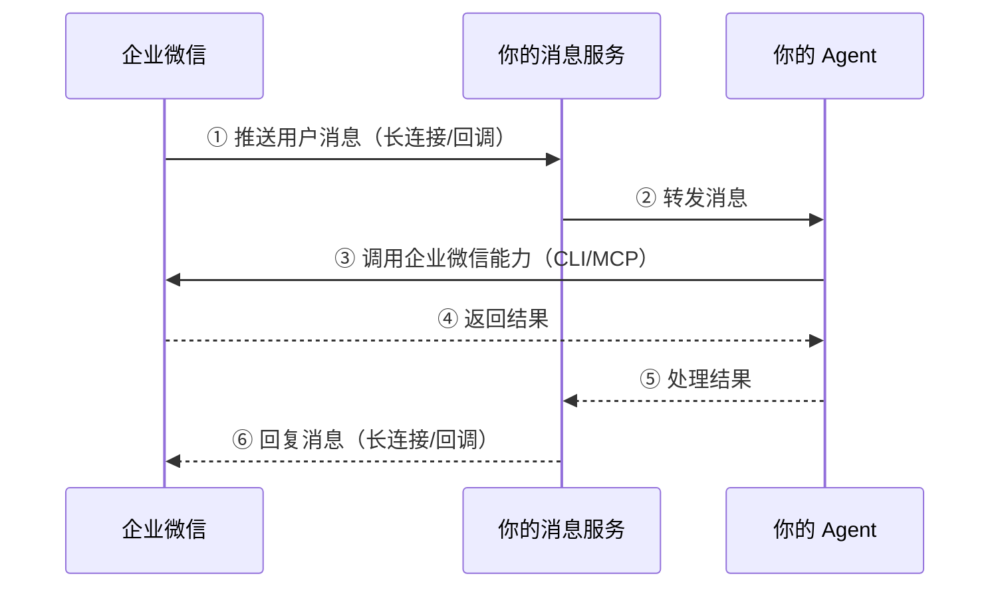

## 1. 简介

智能机器人是可随时向其提问的 AI 同事，支持配置不同的模型与知识并调用工具，让机器人打通企业内外数据与系统，适配企业知识问答、复杂业务流程处理等多类场景。

与传统的应用/群机器人不同，智能机器人面向 AI 场景设计：

- **AI 优先**：面向大模型对话、工具编排等场景优化。支持流式输出，长文本、多媒体等回复。
- **双向通信**：既能被动响应用户消息，也能主动向用户或群聊推送结果。
- **能力开放**：通过配套的 CLI/MCP，智能机器人可以反向调用企业微信的文档、日程、会议、待办、消息等能力，让 AI 真正"能干活"。

## 2. 能力介绍

接入智能机器人后，即可获得以下能力：

### 2.1 消息接收与推送

- 在单聊、群聊中接收用户消息（文本、图片、文件、语音、视频等）。
- 流式回复，支持 Markdown、卡片、文件、图片等多媒体输出。
- 主动推送消息，将 Agent 的异步处理结果实时送达用户。

### 2.2 AI 开发能力

通过官方 CLI/MCP 与配套 Skill，Agent 可以调用企业微信的核心能力，包括：

| 能力 | 能力描述 |
| --- | --- |
| 消息 | 通过机器人发送消息、获取机器人对话过的列表 |
| 邮件 | 发送邮件、检索邮件、读取邮件正文 |
| 文档 | 创建文档、检索文档、读取文档内容、编辑机器人创建的文档 |
| 表格 | 创建表格、检索表格、读取表格内容、编辑机器人创建的表格 |
| 智能表格 | 创建表格、检索表格、读取表格内容、编辑机器人创建的智能表格 |
| 智能文档 | 创建文档、检索文档、读取文档内容、编辑机器人创建的智能文档 |
| 待办 | 创建待办、检索待办、获取待办详情 |
| 日程 | 创建日程、检索日程、获取日程详情 |
| 会议 | 创建会议、检索会议、获取会议详情、获取会议纪要正文 |
| 微盘 | 上传文件、检索文件、下载文件 |
| 通讯录 | 检索用户、读取用户基础信息 |

## 3. 使用场景

### 3.1 在企业微信中使用：

企业相关负责人，如IT 管理员、职能负责人或者业务负责人等，可以为企业搭建智能机器人，给它配上AI模型和专属知识，让它在单聊和群聊里回答其他员工的问题，还可以打通企业内外的数据和系统，并通过企业微信的日程、待办等能力完成落地执行。

常见的使用场景：

- **员工知识问答**：把制度文档、报销流程、设备申请、假期政策等高频问题配置为专属知识，员工在企业微信里直接问、直接得到带出处的答案。
- **打通业务系统**：连接 ERP、CRM 等系统，销售在客户现场问一句"某型号还有多少现货"，机器人直接返回实时库存与最近到货时间。
- **产品知识沉淀与话术生成**：把产品资料沉淀为知识，客户问"两个型号差在哪"，机器人按客户关心的维度自动比对并输出成话术。

### 3.2 在外部AI工具中使用：

动手能力强的员工还可以基于智能机器人的授权，把个人文档、会议、日程这些能力，接入外部AI工具，有效减少在多个工具间的来回切换，无需手动整理数据、复制粘贴，实现高效办公。

常见使用场景：

- **文档一键读改写**：在外部 AI 工具中指定企业微信文档，一键完成读取、精简、回写，格式不再错乱。
- **会议纪要 + 待办派发**：开完会后由 Agent 自动生成纪要，识别行动项并直接建成待办派发到对应人员。
- **业务表格分析 + 群内汇报**：让 Agent 从取数、分析到成文、发群一步完成项目进展汇报。

## 4. 流程概览

一个标准形态的智能机器人由 **三部分** 组成：
- **消息服务**：与企业微信服务端建立长连接/接收回调，把用户消息回调给你的 Agent，并把 Agent 的回复送回用户。
- **Agent**： AI 服务（如大模型 + Agent 框架），负责理解与生成。
- **CLI/MCP**：让 Agent 反向调用企业微信能力（文档、日程、待办等）。

## 5. 上手步骤

1. 在企业微信管理后台创建智能机器人，取得 `Bot ID` 与 `Secret`。获取方式参见 [官方指引](https://open.work.weixin.qq.com/help2/pc/cat?doc_id=21677)。
2. 给 Agent 安装 CLI/MCP 与 Skill，让 Agent 具备操作企业微信的能力。
3. 在 Agent 服务侧，通过长连接或回调建立消息连接。连接建立后，用户在企业微信中发给机器人的消息会实时推送到你的服务。
4. Agent 结合上下文、知识库以及通过 CLI/MCP 获取的企业微信数据，执行操作并生成回复，再通过消息连接送回用户。

至此，智能机器人已经打通 **接收 → 处理 → 回复** 全链路。后续可按需扩展知识库、工具编排、多模态回复等能力。